# Task 2: Differential Power Attack (DPA)

DPA is a type of power analysis attack where the AES key can be derived from the smart card via power consumption. 
 In this lab, we will go over the Hamming Weight, Hamming Distance, and single bit models.

Hamming Weight: The count of all the ones in a byte. Ex.) 1110 0011 = 5

Hamming Distance: How many bits of A are different from B. Ex.) 1110 0011 Vs. 1111 0010 = 2

Single Bit: Not entirely sure how it works TBD.

#### Unknown Key
Key for unknown card *supo500* was *CA FE BA BE 36 69 AA 00 90 60 90 FF 73 75 70 6F*

- Hamming Weight correctly found the key.
- Hamming Distance hypothesis was completely wrong with huge values in the PGE.
- Single Bit corretly found the key after removing the first hypothetical value in byte 3.

#### First Byte Analysis

For the first task, the following three images will contain  a screenshot of the correlation graph with the 
correct hyothetical value and two neighboring values.

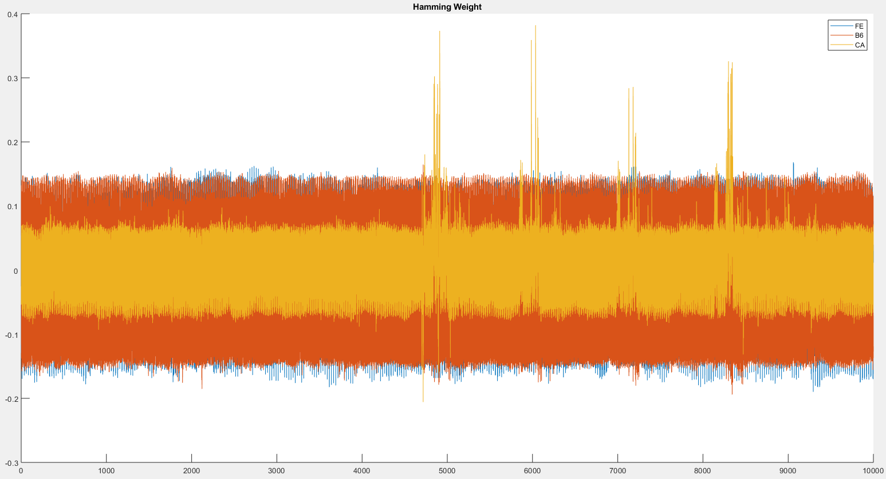
With the Hamming Weight model, the correlation graph found the correct value, 0xCA, with four peaks.
The first peak can be attributed to the intermediate value being stored after the sub-bytes operation. 
The second peak is probably the intermediate value being loaded into the shift-rows operation, followed by the 
third peak which is writing the value after shifting. Finally the fourth operation most likely corresponds to 
the value after the mix-columns operation.
 

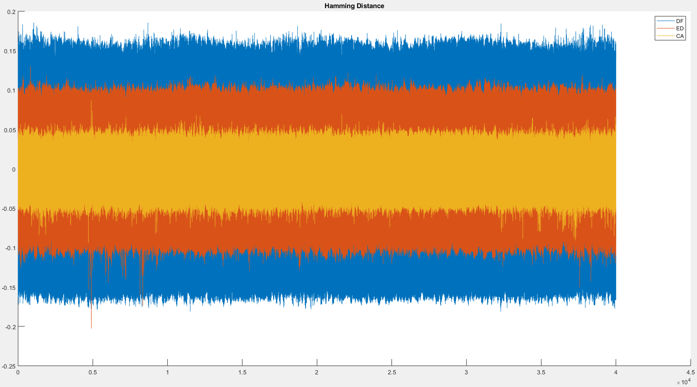
With the Hamming Distance model, the correlation graph could not find any of the encryption bytes. The graph appears to 
have a lot of noise. It would appear this card is not easily broken with the Hamming Distance model, or my implemenation
is flawed.
 

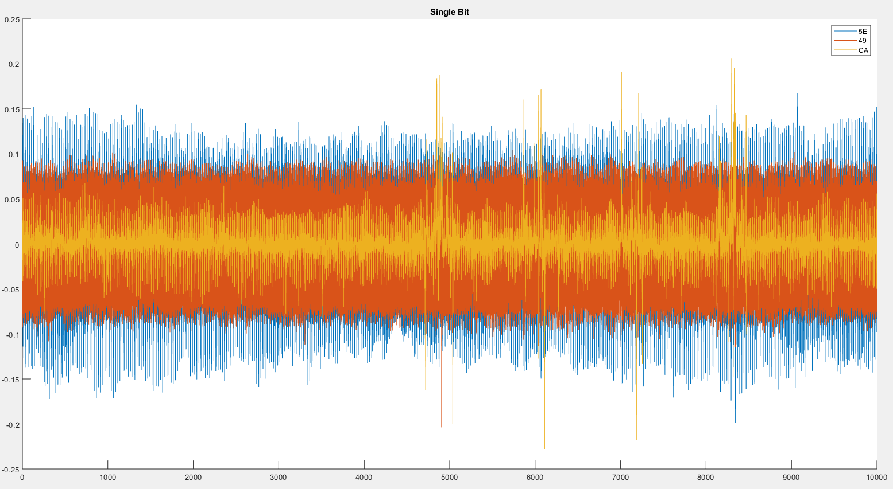
With the Single Bit model, the correlation graph found the correct value, 0xCA, with four peaks. The locations of the 
peaks mirror the peaks found in the Hamming Weight model.
 

#### Partial Guess Entropy (PGE)
Partial guessing entropy is how many additional iterations it takes to find the key.
 Example: Lets say for Byte 1 I get [AA, EE, CA]. Since each byte refers to a row in the correlation matrix,
 I would have to remove that row (zeroing) inorder to find the next hypothesis value. The PGE in this case is 2

- ##### Hamming Weight
##### *PGE for 200 traces*
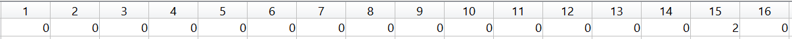
##### *PGE for 100 traces*
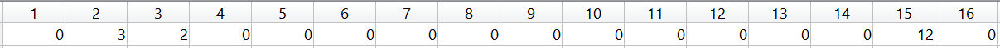
##### *PGE for 50 traces*
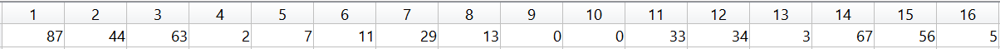

- ##### Hamming Distance
##### *PGE for 200 traces*
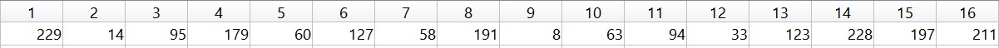
##### *PGE for 100 traces*
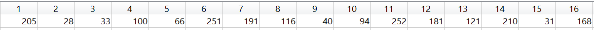
##### *PGE for 50 traces*
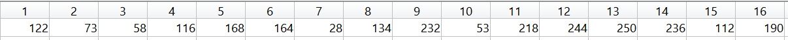

- ##### Single Bit
##### *PGE for 200 traces*
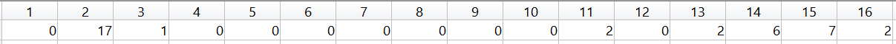
##### *PGE for 100 traces*
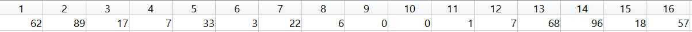
##### *PGE for 50 traces*
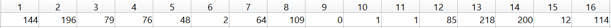